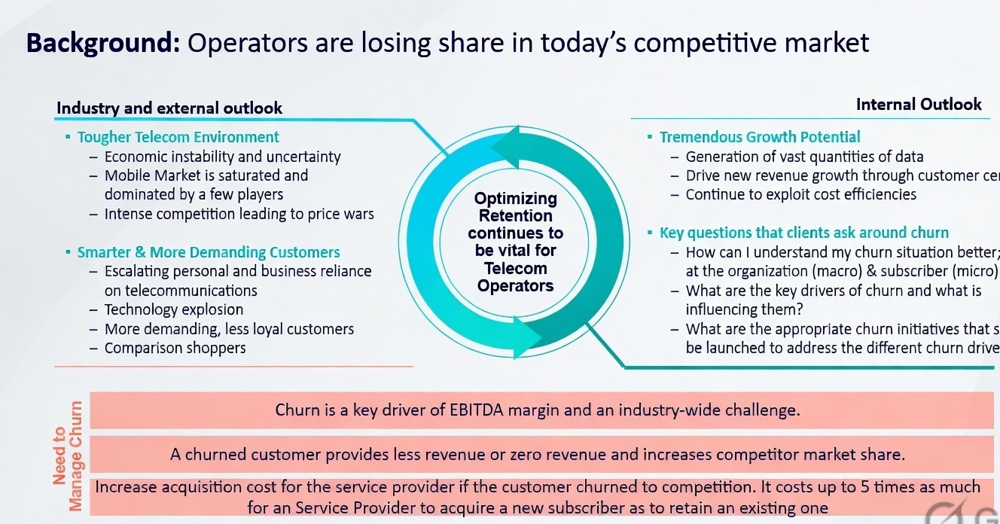
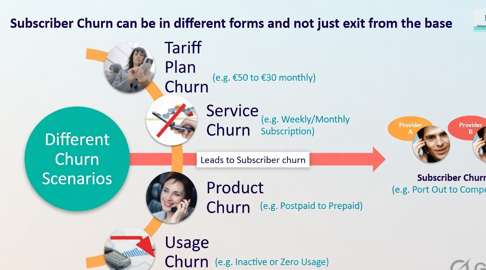
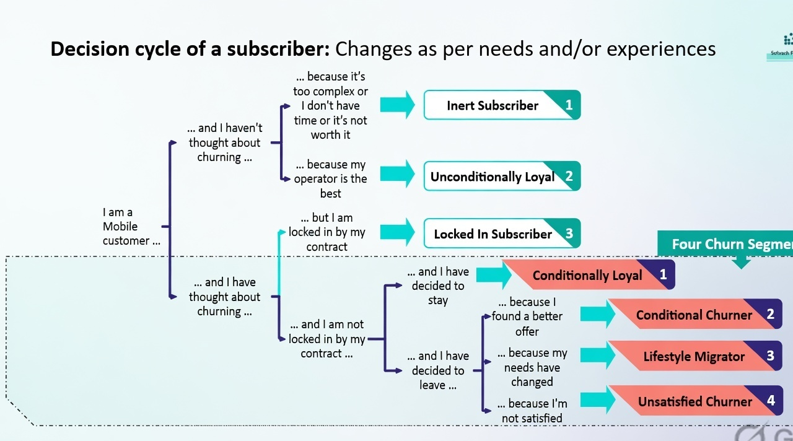
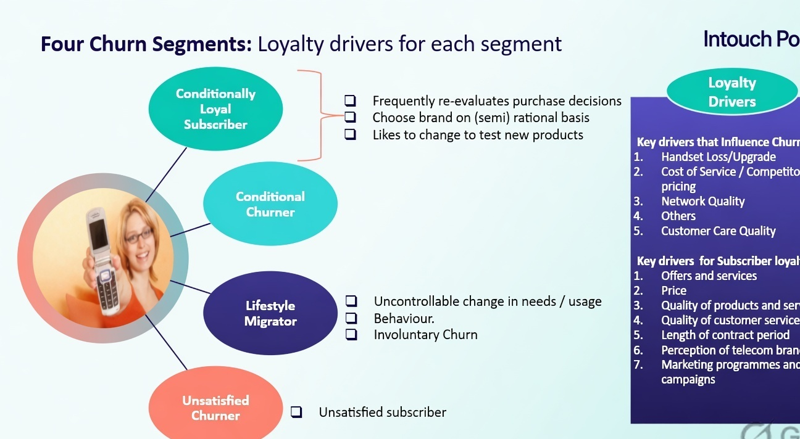
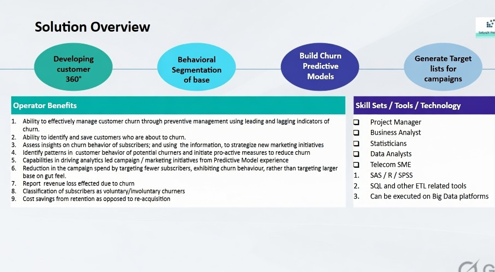
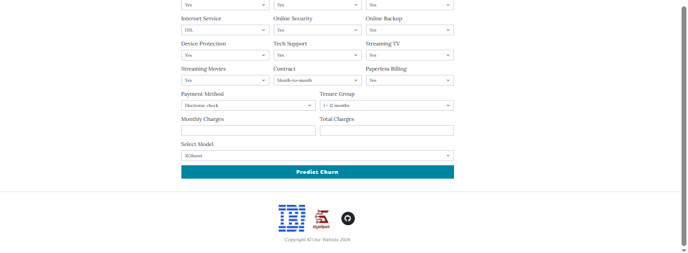

# Customer Retention & Churn Prediction

## 🔴 What is Customer Churning ?



## 🔴 What are the different Churn Scenarios ?



## 🔴 Decision Cycle of a Subscriber ?



## 🔴 What are the different Churn Segments ?



## 🔴 Solution Overview




In this repository, we have performed the end to end Exploratory Data Analysis, and identified the characteristics of the customers that are more likely to churn, and I have used them wisely to create multiple models (including XGBoost), and deployed the model with a full-featured web application that includes user authentication, contact form, and interactive prediction interface.

### 🟢 For EDA, please refer to : Churn Analysis - EDA.ipynb
### 🟢 For Model Building, please refer to: Churn Analysis - Model Building.ipynb
### 🟢 For Model Deployment, please refer to app.py


### 🔵 Creating the Flask API

```python
app = Flask(__name__,
            template_folder='../templates', 
            static_folder='../static')
```

The home route and several other pages (blog, about, contact, signup, signin) are served with dynamic parameters.

```python
@app.route("/")
def home():
    return render_template('index.html',params=param)
```

The machine learning prediction endpoint collects customer features, performs one-hot encoding, loads the selected model, and returns the churn prediction.

```python
@app.route("/machinelearningmodel", methods=['GET', 'POST'])
def ml_model():
    prediction = None
    selected_model = None

    if request.method == 'POST':
        # Collect form data
        form_data = {
            'SeniorCitizen': int(request.form.get('SeniorCitizen')),
            'MonthlyCharges': float(request.form.get('MonthlyCharges')),
            'TotalCharges': float(request.form.get('TotalCharges')),
            'gender': request.form.get('gender'),
            'Partner': request.form.get('Partner'),
            'Dependents': request.form.get('Dependents'),
            'PhoneService': request.form.get('PhoneService'),
            'MultipleLines': request.form.get('MultipleLines'),
            'InternetService': request.form.get('InternetService'),
            'OnlineSecurity': request.form.get('OnlineSecurity'),
            'OnlineBackup': request.form.get('OnlineBackup'),
            'DeviceProtection': request.form.get('DeviceProtection'),
            'TechSupport': request.form.get('TechSupport'),
            'StreamingTV': request.form.get('StreamingTV'),
            'StreamingMovies': request.form.get('StreamingMovies'),
            'Contract': request.form.get('Contract'),
            'PaperlessBilling': request.form.get('PaperlessBilling'),
            'PaymentMethod': request.form.get('PaymentMethod'),
            'tenure_group': request.form.get('tenure_group')
        }

        # Convert to DataFrame
        input_df = pd.DataFrame([form_data])

        # One-hot encoding
        input_encoded = pd.get_dummies(input_df)

        # Load saved column order
        with open("models/model_columns.pkl", "rb") as f:
            model_columns = pickle.load(f)

        # Match training columns
        input_encoded = input_encoded.reindex(columns=model_columns, fill_value=0)

        # Load selected model
        selected_model = request.form.get('model_name')
        model_path = f"models/{selected_model}"

        with open(model_path, "rb") as f:
            model = pickle.load(f)

        # Predict
        result = model.predict(input_encoded)[0]
        prediction = "Churn" if result == 1 else "No Churn"

    return render_template(
        'machinelearning.html',
        params=param,
        prediction=prediction,
        selected_model=selected_model
    )
```

The run() method of Flask class runs the application.

```python
if __name__=="__main__":
    port = int(os.environ.get("PORT", 5000))
    app.run(host="0.0.0.0", port=port)
```


Yay, our model is ready, let’s test our bot.
The above given Python script is executed from the terminal.

```bash
python app.py
```


Below message indicates that our App is now hosted at http://127.0.0.1:5000/ or localhost:5000

```
* Running on http://127.0.0.1:5000/ (Press CTRL+C to quit)
```


HERE'S HOW OUR FRONTEND LOOKS LIKE:


